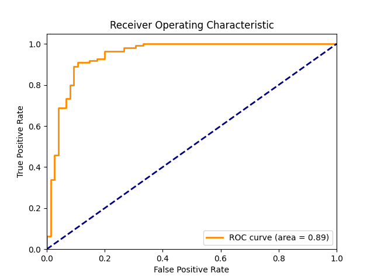

# HeartDiseasePredictor

**HeartDiseasePredictor** is a machine learning project developed in Python that utilizes clinical data to predict the presence of heart disease in patients. This model aims to assist healthcare professionals in identifying cardiac risks more quickly by using data analysis and machine learning techniques.

## Dataset

The data used in this project were obtained from the [Heart Disease UCI Dataset](https://www.kaggle.com/datasets/redwankarimsony/heart-disease-data/data) available on Kaggle.

### About the Dataset

#### Context

This is a multivariate dataset, meaning it involves multiple separate mathematical or statistical variables. It consists of 14 attributes: age, sex, chest pain type, resting blood pressure, serum cholesterol, fasting blood sugar, resting electrocardiographic results, maximum heart rate achieved, exercise-induced angina, oldpeak (ST depression induced by exercise relative to rest), the slope of the peak exercise ST segment, number of major vessels, and Thalassemia. The Cleveland database, which includes 76 attributes in total, is the only one used by ML researchers to date. The main task is to predict whether a patient has heart disease based on these attributes, and to derive various insights from the dataset to better understand the problem.

#### Column Descriptions

- `id`: Unique id for each patient
- `age`: Age of the patient in years
- `sex`: Male/Female
- `cp`: Chest pain type ([typical angina, atypical angina, non-anginal, asymptomatic])
- `trestbps`: Resting blood pressure (in mm Hg on admission to the hospital)
- `chol`: Serum cholesterol in mg/dl
- `fbs`: Fasting blood sugar > 120 mg/dl
- `restecg`: Resting electrocardiographic results ([normal, stt abnormality, lv hypertrophy])
- `thalach`: Maximum heart rate achieved
- `exang`: Exercise-induced angina (True/False)
- `oldpeak`: ST depression induced by exercise relative to rest
- `slope`: The slope of the peak exercise ST segment
- `ca`: Number of major vessels (0-3) colored by fluoroscopy
- `thal`: [normal; fixed defect; reversible defect]
- `num`: The predicted attribute

### Acknowledgements

Creators:
- Hungarian Institute of Cardiology. Budapest: Andras Janosi, M.D.
- University Hospital, Zurich, Switzerland: William Steinbrunn, M.D.
- University Hospital, Basel, Switzerland: Matthias Pfisterer, M.D.
- V.A. Medical Center, Long Beach and Cleveland Clinic Foundation: Robert Detrano, M.D., Ph.D.

## Project Structure

- `data/`: Contains the original dataset.
- `notebooks/`: Jupyter notebooks with data exploratory analysis and model development.
- `src/`: Python scripts used in the project.
  - `main.py`: Main script for loading data, training the model, and saving the best model.
  - `figures/`: Directory containing generated plots and figures.
  - `models/`: Directory containing the saved trained models.
- `README.md`: Project description and usage instructions.

## How to Use

1. Clone this repository: `git clone https://github.com/danielprazeres/HeartDiseasePredictor.git`
2. Navigate to the project directory: `cd HeartDiseasePredictor`
3. Create and activate a virtual environment: `python -m venv venv && source venv/bin/activate` (Linux/Mac) or `.\venv\Scripts\activate (Windows)
4. Install dependencies: `pip install -r requirements.txt`
5. Run the code: `python src/main.py`

## Generated Plots

- ROC Curve:
  

- Additional Plots:
  

## Best Model

The best model was a Random Forest Classifier with the following hyperparameters:
- `max_depth`: 10
- `min_samples_leaf`: 1
- `min_samples_split`: 2
- `n_estimators`: 100

The model achieved an accuracy of 90% on the test set.

## Evaluation Metrics

Best Random Forest Confusion Matrix:
[[66  9]
 [10 99]]

Best Random Forest Classification Report:
              precision    recall  f1-score   support

           0       0.87      0.88      0.87        75
           1       0.92      0.91      0.91       109

    accuracy                           0.90       184
   macro avg       0.89      0.89      0.89       184
weighted avg       0.90      0.90      0.90       184

Cross-Validation Scores: [0.65217391 0.64130435 0.96195652 0.91847826 0.61413043]
Average Cross-Validation Score: 0.76
Random Forest AUC-ROC: 0.89

## How to Use the Model

You can load and use the saved model in other scripts as follows:

```python
import joblib

# Load the model
model_path = 'src/models/best_random_forest_model.pkl'
model = joblib.load(model_path)

# Use the model for predictions
predictions = model.predict(X_new)
```

## Contributions

Contributions are welcome! Please open a pull request or an issue to discuss any changes.

## License

This project is licensed under the MIT License. See the LICENSE file for more details.

## Author

Daniel Prazeres

## References

Kaggle: Heart Disease UCI Dataset
Detrano, R., Janosi, A., Steinbrunn, W., Pfisterer, M., Schmid, J., Sandhu, S., Guppy, K., Lee, S., & Froelicher, V. (1989). International application of a new probability algorithm for the diagnosis of coronary artery disease. American Journal of Cardiology, 64, 304-310.
David W. Aha & Dennis Kibler. "Instance-based prediction of heart-disease presence with the Cleveland database."
Gennari, J.H., Langley, P., & Fisher, D. (1989). Models of incremental concept formation. Artificial Intelligence, 40, 11-61.